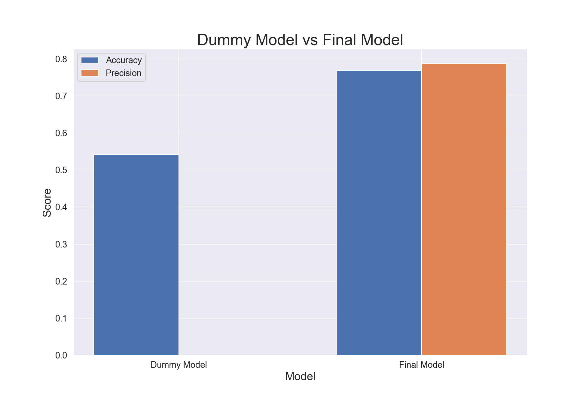

# Seasonal Flu Vaccine Classification Model

author: Alison Park


<sup>(source. https://www.google.com/url?sa=i&url=https%3A%2F%2Fcovid19.columbia.edu%2Fvaccine-info&psig=AOvVaw19xp9FX5tJZslOLtsu4kL1&ust=1682194849826000&source=images&cd=vfe&ved=2ahUKEwiUyICl5rv-AhUwrYkEHQ7gBqsQjRx6BAgAEAw)</sup>

## Overview
Our objective was to develop a classification model to help the Flatiron Hospital improve vaccination rates among its patient population. By accurately predicting which patients are more likely to receive the seasonal flu vaccine, the hospital can target these individuals with personalized messaging and reminders to increase vaccination rates and ultimately improve public health outcomes. To achieve this, we created a random forest model with a precision score of .7807 to predict which patients are likely to receive the seasonal flu vaccine.


## Business Understanding
Despite the availability and effectiveness of the seasonal flu vaccine, many individuals continue to forego it each year. The Flatiron Hospital recognizes the importance of improving vaccination rates among its patient population. To achieve this, we developed a predictive model that leverages patient demographics, behaviors, and beliefs about vaccination to identify those who are most likely to receive the seasonal flu vaccine. By targeting these high-risk individuals with personalized messaging and reminders, we hope to increase vaccination rates and ultimately improve public health outcomes.

Our model's insights and recommendations have the potential to significantly impact public health and reduce the number of illnesses, hospitalizations, and deaths caused by the seasonal flu. We believe that these findings can be applied to other hospitals and healthcare systems in their efforts to improve vaccination rates and protect their communities from the spread of influenza.


## Data Understanding

In late 2009 and early 2010, the United States conducted the National 2009 H1N1 Flu Survey, which collected data on respondents' vaccination status for the H1N1 and seasonal flu vaccines, as well as their social, economic, and demographic backgrounds, beliefs about the risks of illness and vaccine effectiveness, and behaviors related to mitigating transmission. The dataset contains 35 features and 26,707 data entries, and can be accessed via the following link: (https://www.drivendata.org/competitions/66/flu-shot-learning/page/211/).


## Methods

This project uses machine learning tools to make different types of models and gridsearch for hyperparameters to optimize the model.


## Final Model

We decided to use the last grid search for the random forest model as the final model. This model had a precision score of 0.7898. A precision of 0.79 means that out of all the patients that the model predicted as likely to receive the seasonal flu vaccine, 79% of them actually received it. In other words, the model correctly identified 79% of the patients who received the vaccine, and 21% of the patients it identified as likely to receive the vaccine did not actually receive it. 



This shows the dummy model, model that purely guesses the most frequent (no disease), compared to the final model. As you can both the accuracy and precison scores increased with our final model which means that this model will be more precise when predicing which patients will get a seasonal flu vaccine.


## Interpretation of Model


This graph shows the top 10 key features that is important to predict which patients will get the seasonal flu vaccine. I will be highlighting doctor's recommendation and age group (graphs are up in EDA section).


For those who got a doctor's recommendation, 73.8% of the patients received a vaccine. This is a drastic difference to only 34.6% of patients receiving the vaccine when they did not get a doctor's recommendation. It seems to be that a doctor's recommendation is important in a patient's decision to receive the flu vaccine.


Age group 65+ have the highest vaccination rates. The bottom three age groups have more people that have not received the vaccine than those who did. This might be due to health policies already set in place for the elderly since they are at a higher-risk of getting sick. Since herd immunity is important, it is imperative to target the younger age groups as well to increase the overall effectivness of the vaccine.


## Conclusions

In conclusion, our final model can predict with a precision of 79% whether or not a patient will get the seasonal flu vaccine. This performance is promising and suggests that the model can be useful in predicting and encouraging patients to get vaccinated. However, it is important to acknowledge that the model's performance may be influenced by factors such as the quality and quantity of the data used to train it, as well as the specific features and parameters selected.

Our analysis revealed that opinion for the risk of getting the flu was the most important feature for predicting whether or not a patient will get vaccinated. This underscores the importance of providing accurate information and knowledge about the flu to help patients make informed decisions about vaccination.

Additionally, we found that doctor's recommendation and age group were also important features. We recommend that hospitals encourage doctors to recommend the flu vaccine to all eligible patients, as doctor's recommendation has a significant impact on patients' decisions. Moreover, targeting younger populations can help increase herd immunity and reduce the spread of the flu, which can ultimately reduce hospitalization and mortality rates. The fact that the +65 age group had the highest vaccination rate suggests that current policies for high-risk groups are effective and could be expanded to include other vulnerable populations.

## Next Steps

While our model demonstrated promising predictive ability, further analysis and testing will be necessary to validate its precision and robustness in real-world scenarios. Since the data used for this study was from 2009, it is important to obtain more recent data to account for any changes in public opinion regarding the flu vaccine, especially in light of the COVID-19 pandemic. Additionally, given that the flu is a global issue, it would be beneficial to collect data from a larger and more diverse population to ensure that our model's findings can be generalized to other regions beyond just New York State or the US.

To improve the robustness of our model, we recommend exploring alternative machine learning algorithms such as XGBoost or conducting further grid searches on the random forest model to identify the optimal categorical model. This would enable us to identify more accurate features to target for future hospital policies.

Overall, the results of our study suggest that additional research is necessary to further refine the model's precision and predictive ability, and to ensure that it can be effectively applied in real-world settings.

## For Inquiries, Business Proposals, or Additional Information...

Our process is available in this [Jupyter Notebook](./final_notebook.ipynb) or abbreviated in this [presentation](./Phase3-Flu _Classification-Alison_Park.pdf).

We can be contacted via email at [alisonsjpark@gmail.com \(Alison\)](mailto:alisonsjpark@gmail.com) 


## Repository structure

```
├── data
│   ├── submission_format.csv
│   ├── test_set_features.csv
│   ├── training_set_features.csv
│   └── training_set_label.csv
├── images
│   ├── age.png
│   ├── doctor_rec.png
│   ├── dummy_vs_final.png
│   ├── top_10_features.png
│   └── vaccine.jpeg
├── final_notebook.ipynb
├── index_scratch.ipynb
├── LICENSE
├── Phase3-flu_Classification_Alison_Park.pdf
└── README.md
```


